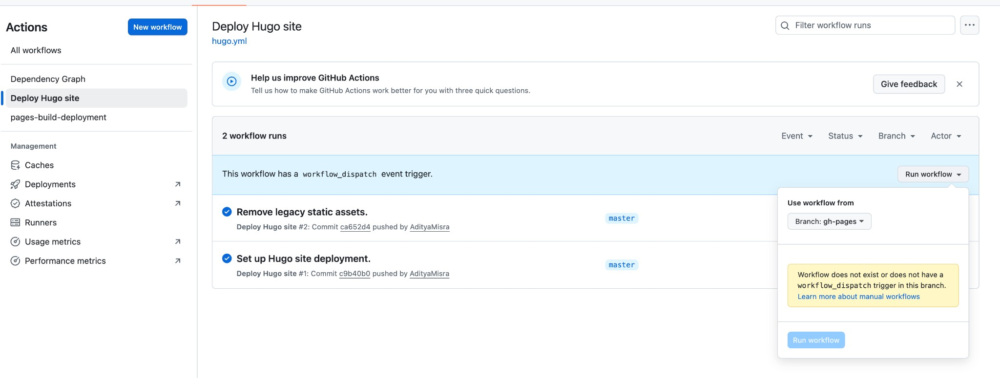

# Aditya Misra — Personal Website

This repo contains the source for the personal site hosted at https://adityamisra.github.io/.

## Structure
- `content/` — page content in Markdown
- `assets/` — pipeline assets (CSS, images, theme resources)
- `static/` — static files copied as-is
- `hugo.toml` — site configuration
- `data/` — structured data (YAML)

## Local preview
Run `hugo server` and open http://localhost:1313.

## Build & deploy
Local build:
- Install deps: `npm install`
- Build: `hugo --minify`
- Output: `public/`

Deploy to GitHub Pages:
- Push changes to `master`
- GitHub Actions builds the site and publishes the generated `public/` folder to the `gh-pages` branch
- GitHub Pages serves the `gh-pages` branch at https://adityamisra.github.io/

## GitHub Actions
Workflow file: `.github/workflows/hugo.yml`

What it does:
- **Checkout**: pulls the repo contents into the runner
- **Setup Go**: needed for Hugo modules
- **Setup Hugo**: installs Hugo (extended)
- **Setup Node**: installs Node.js and enables npm cache
- **Install dependencies**: runs `npm install`
- **Build site**: runs `hugo --minify` to generate `public/`
- **Deploy to GitHub Pages**: pushes `public/` to `gh-pages`

## Screenshots
GitHub Actions manual run (select `master` in “Use workflow from”):

## Troubleshooting
- **Workflow not found on `gh-pages`**: run the workflow from `master`; `gh-pages` only stores built output.
- **Site not updating**: confirm GitHub Pages is set to deploy from `gh-pages` and the workflow completed successfully.
- **Missing icons / manifest 404s**: ensure the favicon source is valid in `hugo.toml` and re-run the workflow.

## References
- Adritian theme: https://github.com/zetxek/adritian-free-hugo-theme
